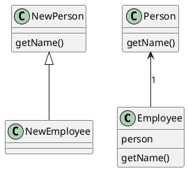
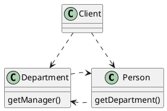
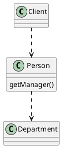

## Large Class(过大类)
### Symptoms
A class contains many fields/methods/lines of code
A class has too many responsibilities(violate SRP)

### Treatment
- Extract Class: split into classes based on their responsibility
- Extract Subclass: partial behavior only be used in very rare cases
- Extract Interface

### Payoff
- Readability
- SRP

## Primitive Obsession(基本类型偏执)
### Symptoms
Use of primitives instead of small objects for simple tasks
```cpp
class MyClass {
    int Level_;
    string Id;
}

MyClass user{1, "normal user"};
```

### Treatment
- Replace data value with Object
- Replace array with Object
```cpp
enum class UserLevel {
    NORMAL,
    ADMIN
};

class UserId {
    ...
};

class MyClass {
    UserLevel level_;
    UserId id_;
}
```

### Payoff
- Readability
- Flexibility
- Avoiding duplicate

## Long parameter list(过长参数列表)
### Symptoms
Method takes too many parameters(usually more than 5)
```cpp
void func(int a1, int a2, int a3, string s1, string s2, ...)
```

### Treatment
- Replace parameter with method call
```cpp
// before
void func(Object o1, Object o2, int a1, int a2, int a3,...){
    // use a1, a2
}

// after
void func(Object o1, Object o2, int a3){
    // a1 = o1.a;
    // a2 = o2.a
    // use a1, a2
}
```
- Preserve whole object
```cpp
// before
void func(int a1, int a2, int a3, string s1, string s2);

MyClass o;
func(o.a1, o.a2, o.a3, s1, s2);

// after
void func(MyClass o, string s1, string s2);

MyClass o;
func(o, s1, s2);
```
- Introduce parameter object
```cpp
// before
void func(int a1, int a2, int a3, string s1, string s2);

// after
class MyClass {
    int a1;
    int a2;
    int a3;
    string s1;
    ...
};
void func(MyClass o);
```

### Payoff
- Readability
- Shorter code

## Data clumps(数据泥团)
### Symptoms
- Different parts of the code contain identical groups of variables
```cpp
class Student {
    ...
    int score;
    string name;
    string email;
    Address address;
};

class Teacher {
    ...
    Department dep;
    int salary;
    string name;
    string email;
    Address address;
};
```

### Treatment
- Extract class
```cpp
class BasicInfo {
    string name;
    string email;
    Address address;
};

class Student {
    ...
    int score;
    BasicInfo info;
};

class Teacher {
    ...
    Department dep;
    int salary;
    BasicInfo info;
};
```
- Introduce parameter object (data clumps in function call)
- Preserve whole object

## Switch statements(switch语句滥用)
### Symptoms
Have complex switch operators or sequence of if statements
```cpp
Shape o;
switch(o.type){
    case "CIRCLE":
        o.drawCircle();
    case "TRIANGLE":
        o.drawTriangle();
    case "SQUARE":
        o.drawSquare();
    ...
}
```

### Treatment
- Replace type code with subclass
- Replace type code with state/strategy pattern
- Replace conditional with polymorphism
```cpp
class Shape{
    virtual void draw() = 0;
};
class Circle : public class Shape {}
class Square : public class Shape {}

Shape o;
o.draw();
```

## Temporary Field(临时字段)
### Symptoms
Have member variables(fields) used only in certain circumstances(rarely used)
```cpp
class MyClass {
    string myString;
    int myNumber;

    void func1() { // use myString and myNumber; }

    // all remained methods never use myString and myNumber at all
    ...
};
```

### Reason
some member methods need complicated inputs, so instead of creating long parameter list, the programmer decides to create member variable for this data in the class

### Treatment
- Extract class(Replace method with method object) -- put temporary fields and operations on it into new class
```cpp
class MyOperation {
    string myString;
    int myNumber;
};

class MyClass{
    void func1() {
        // create MyOperation object and use it
        MyOperation op{...};
        ...
    }

    ...
}
```

### Payoff
- Clarity
- Organization

## Refused Bequest(拒绝继承)
### Symptoms
A subclass only use a part of member methods and variables of super class
```cpp
class AnimalLeg{
    int length_;

    int getLength();
    bool hasHair();
};

class ChairLeg : public AnimalLeg {
    ...
    // this class never need `hasHair` method
    // because a chair has no hair
};
```

### Reason
Create inheritance between classes only by the desire to reuse common code in super class, but the super class and subclass are completely different

### Treatment
- Replace inheritance with delegation -- eliminate inheritance
```cpp
class Leg{
    int length_;
    int getLength();
    ...
};

class Animal{
    Leg animalLeg_;

    bool hasHair()
    ...
};

class Chair{
    Leg chaiLeg_;
    ...
};
```

- Extract super class
```cpp
class Leg{
    // common properties of leg
};
class AnimalLeg : public class Leg{
    // properties of a animal leg
}
class ChairLeg : public class Leg{
    // properties of a chair leg
}
```

### Payoff
- Clarity / Organization

## Alternative Classes with Different Interfaces(冗余接口)
### Symptoms
Two classes perform identical functions but have different method names
```cpp
class StringUtility{
    string join(...){}
    string cat(...){}
    ...
};

class StringUtils {
    string joinString(...){}
    string catString(...){}
}
```

### Treatment
- Rename method -- make them identical in all alternative classes
- Move Method/ Add Parameter / Parameterize Method -- make the signature and implementation of methods the same
- Extract super class -- reuse common functionality
- Delete duplicated implementations

### Payoff
- clean
- avoid duplication

## Divergent Change(发散式变化)
### Symptoms
Have to change many unrelated methods when you make changes to a class
eg. When adding a new product type you have to change methods for finding, displaying and ordering products
```cpp
// use switch statements to determine product type and take actions
```
### Reason
class has too many responsibilities

### Treatment
- Extract class -- split up the behavior of the class

## Shotgun Surgery(霰弹式修改)
### Symptoms
Making any modifications requires that you make many small changes to many different classes

### Reason
A single responsibility has been split up among a large number of classes

### Treatment
- Move Method/ Move Field -- move existing class behaviors into a single class

## Parallel Inheritance Hierarchies(平行继承体系)
### Symptoms
Whenever you want create a subclass for a class, you have to create subclass for another class

### Todo...

## Comments
### Treatment
- Extract Variable -- split up a complex expressions into several more understandable sub expressions
- Extract Method -- split up large function into several sub function with better function name
- Rename Method
- Introduce Assertion

## Duplicated Code(冗余代码)
### Treatment
#### same code found in two or more methods in the same class
```cpp
class MyClass {
    void func1() {
        // get current time
        // print time
    }

    void func2() {
        // get current time
        // calculate the time an hour later
    }
}
```
- Extract Method -- extract common functionality code
```cpp
class MyClass {
    Time getTime(){...}

    void func1() {
        getTime();
        ...
    }

    void func2() {
        getTime();
        ...
    }
}
```

#### same code found in two subclasses of the same level
```cpp
class GameCharacter {...}

class Monster : public class GameCharacter {
    int health;

    void attack(){
        // calculate the monster's current health
        // use health
    }
    ...
}

class Player : public class GameCharacter {
    int health;

    void defend() {
        // calculate the player's current health
        // use it
    }
}
```
- Extract Method + Pull Up Field -- move common functionality to super class
```cpp
class GameCharacter {
    int health;
    int calcCurrentHealth() {...}
}

class Monster : public class GameCharacter {
    void attack {
        // use `calcCurrentHealth()`
    }
}

class Player : public class GameCharacter {
    void defend(){
        // use `calcCurrentHealth()`
    }
}
```
- Pull Up Constructor Body -- if duplicate code is inside a constructor
- Form Template Method -- if the duplicate code is similar but not completely identical
- Substitute Algorithm -- if two methods do the same thing but use different algorithms, select the best algorithms

#### same code found in two different classes
- Extract Super Class -- if the classes aren't part of a hierarchy, create a single super class to maintain common functionality
- Extract Class -- if impossible to create a super class, extract common functionality into new class and use delegation

#### many conditional expressions lead to the same result or actions(only different in their conditions)
```cpp
double disabilityAmount() {
  if (seniority < 2) {
    return 0;
  }
  if (monthsDisabled > 12) {
    return 0;
  }
  if (isPartTime) {
    return 0;
  }
  // Compute the disability amount.
  // ...
}
```
- Consolidate Conditional Expression + Extract Method -- put them into single conditions and move it into a new function with a understandable name
```cpp
double disabilityAmount() {
    if (isNotEligibleForDisability()){
        return 0;
    }
}

bool isNotEligibleForDisability() {
    return seniority < 2 || monthsDisabled > 12 || isPartTime;
}
```
#### same code performed in all branches of a conditional expressions
```cpp
if (isSuccess){
    // perform success actions

    doCommonActions();
} else {
    // perform failure actions

    doCommonActions():
}
```
-- Consolidate Duplicate Conditional Fragments -- place the identical code outside of the condition tree
```cpp
if (isSuccess){
    // perform success actions
} else {
    // perform failure actions
}
doCommonActions():
```

## Lazy Class(冗余类)
### Symptoms
A class is too small to keep it as a class, it should be deleted

### Treatment
- Inline class
- Collapse Hierarchy

## Data Class(数据类)
### Symptoms
A class only contains data fields and setter/getter methods

### Treatment
- Encapsulate Field -- avoid direct access
- Encapsulate Collections -- export interfaces to manipulate inner collections
- Move Method/ Extract Method -- move/extract method which manipulate the data class into itself
- Remove Setting Method/ Hide Method -- hide overly broad access to data fields

## Dead Code
just delete it

## Speculative Generality(夸夸其谈未来性)
### Symptoms
A class is never used but it's said that it will be used in the future

### Treatment
delete

## Feature Envy(特性依恋)
### Symptoms
A method access the data of another object more than its own data

### Treatment
- Move Method -- if a method clearly should be moved to another object
- Extract Method -- if only a part of a method access the data of an another object, extract the part and move it to another object

## Inappropriate Intimacy(狎昵关系)
### Symptoms
A class uses the internal fields and methods of another class

### Treatment
- Hide Delegate
- Change Bidirectional Association to Unidirectional
- Replace Delegation with Inheritance


## Message Chains(消息链)
### Symptoms
a->b()->c()->d()...

###
- Hide delegate -- Client shouldn't know inner details of its dependency


## Middle Man(中间人)
### Symptoms
A class's only work is to delegate work to another class

### Treatment
- Remove Middle Man -- reverse of message chains
